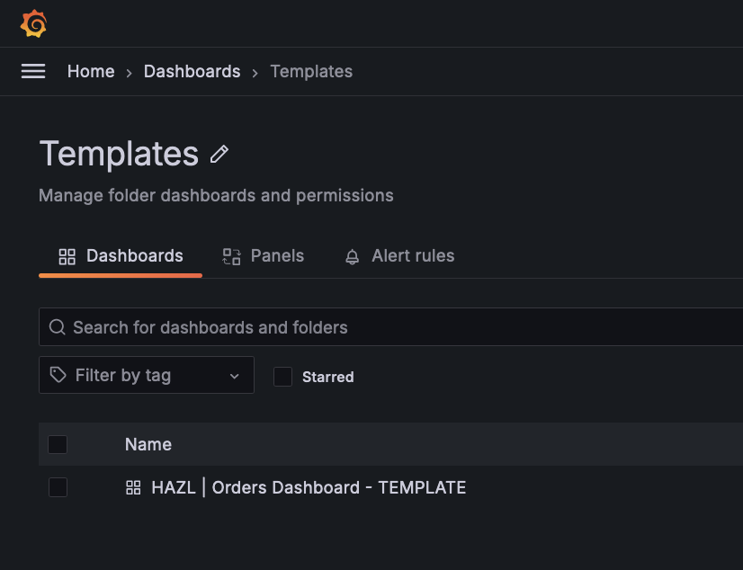
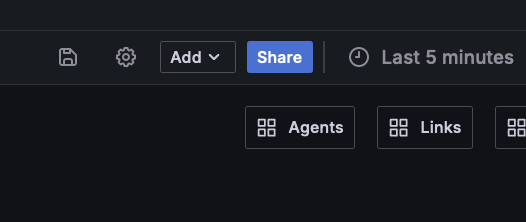
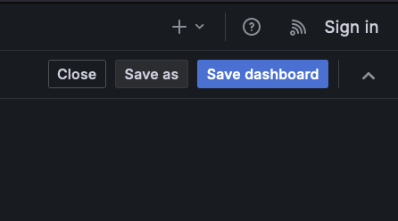
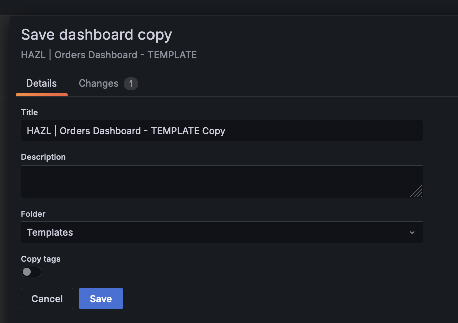
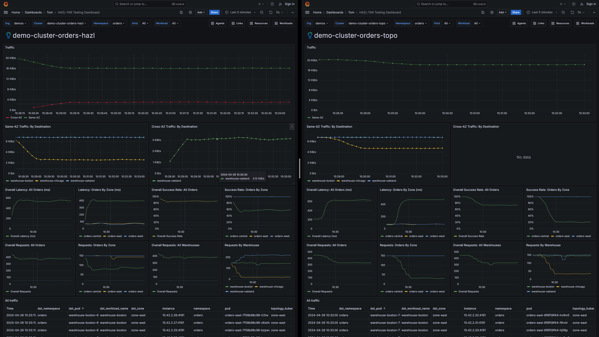

# HAZL | Orders Playground

## hazl-orders-playground

### Tom Dean | Buoyant

### Last edit: 5/28/2024

## Introduction

This repository has quick-start steps to deploy **Buoyant Enterprise for Linkerd** in a `k3d` cluster, and enable **High Availability Zonal Load Balancing (HAZL)** in that cluster.

## High Availability Zonal Load Balancing (HAZL)

**High Availability Zonal Load Balancing (HAZL)** is a dynamic request-level load balancer in **Buoyant Enterprise for Linkerd** that balances **HTTP** and **gRPC** traffic in environments with **multiple availability zones**. For Kubernetes clusters deployed across multiple zones, **HAZL** can **dramatically reduce cloud spend by minimizing cross-zone traffic**.

Unlike other zone-aware options that use **Topology Hints** (including **Istio** and open source **Linkerd**), **HAZL** _never sacrifices reliability to achieve this cost reduction_.

In **multi-zone** environments, **HAZL** can:

- **Cut cloud spend** by eliminating cross-zone traffic both within and across cluster boundaries;
- **Improve system reliability** by distributing traffic to additional zones as the system comes under stress;
- **Prevent failures before they happen** by quickly reacting to increases in latency before the system begins to fail.
- **Preserve zone affinity for cross-cluster calls**, allowing for cost reduction in multi-cluster environments.

Like **Linkerd** itself, **HAZL** is designed to _"just work"_. It works without operator involvement, can be applied to any Kubernetes service that speaks **HTTP** / **gRPC** regardless of the number of endpoints or distribution of workloads and traffic load across zones, and in the majority of cases _requires no tuning or configuration_.

For more information, click [here](more-hazl.md).

## Playground: Prerequisites

**You're going to need the following:**

- [Docker](https://docs.docker.com/get-docker/)
- [Helm](https://helm.sh/docs/intro/install/)
- [k3d](https://k3d.io)
- [step](https://smallstep.com/docs/step-cli/installation/)
- [oha conatiner image in your Docker image repo](https://github.com/hatoo/oha)
- The `kubectl` command must be installed and working
- The `watch` command must be installed and working, if you want to use it
- The `kubectx` command must be installed and working, if you want to use it
- [Buoyant Enterprise for Linkerd License](https://enterprise.buoyant.io)
- [The Demo Assets, from GitHub](https://github.com/BuoyantIO/hazl-orders-playground)

All prerequisites must be _installed_ and _working properly_ before proceeding. The instructions in the provided links will get you there. A trial license for Buoyant Enterprise for Linkerd can be obtained from the link above. Instructions on obtaining the demo assets from GitHub are below.

## Playground: Included Assets

The top-level contents of the repository looks something like this:

```bash
.
├── README.md                            <-- This README
├── buoyant-cloud-metrics.yaml           <-- Manifest to enable latency metrics in Buoyant Cloud (enabled with the script)
├── certs                                <-- Directory for the TLS root certificates (empty)
├── cluster                              <-- The k3d cluster configuration files live here
├── cluster_destroy.sh                   <-- Script to destroy the cluster environment
├── cluster_setup.sh                     <-- Script to stand up the clusters, install Linkerd and Orders on both clusters
├── cluster-the-hard-way.md              <-- Instructions on how to manually stand up the clusters - _(needs some updates)_
├── more-hazl.md                         <-- More information on HAZL
├── images                               <-- Images for the README
├── orders -> orders-oha-bb/orders-hpa
├── orders-colorwheel
├── orders-colorwheel                    <-- The Orders application, uses Colorwheel
│   ├── orders-hpa-colorwheel            <-- The Orders application, with Horizontal Pod Autoscaling
│   ├── orders-nohpa-colorwheel          <-- The Orders application, without Horizontal Pod Autoscaling
│   ├── warehouse-config-120ms.yaml
│   ├── warehouse-config-80ms.yaml
│   └── warehouse-config.yaml
├── orders-oha-bb
├── orders-oha-bb                        <-- The Orders application, uses oha/bb
│   ├── orders-hpa                       <-- The Orders application, with Horizontal Pod Autoscaling
│   └── orders-nohpa                     <-- The Orders application, with Horizontal Pod Autoscaling
├── slow_cooker.yaml                     <-- Manifest for slow_cooker, to generate some additional traffic, if desired
└── testing-oha-bb
    ├── failure-chicago                  <-- Manifests to induce failure in the Chicago warehouse
    │   ├── warehouse-chicago-hazl-bb-100-fail.yaml
    │   ├── warehouse-chicago-hazl-bb-25-fail.yaml
    │   ├── warehouse-chicago-hazl-bb-50-fail.yaml
    │   └── warehouse-chicago-hazl-bb-75-fail.yaml
    ├── latency-oakland                  <-- Manifests to induce latency in the Oakland warehouse
    │   ├── warehouse-oakland-hazl-bb-400ms-latency.yaml
    │   ├── warehouse-oakland-hazl-bb-600ms-latency.yaml
    │   └── warehouse-oakland-hazl-bb-800ms-latency.yaml
    ├── sp-orders.yaml                   <-- Manifest for the Orders ServiceProfile, to enable/disable retries
    └── traffic_check.sh                 <-- Script to monitor application traffic
```

## Playground: Automation

The repository contains the following automation:

- `cluster_setup.sh`
  - Script to stand up the cluster, install Linkerd and Orders
- `cluster_destroy.sh`
  - Script to destroy the cluster environment
- `traffic_check.sh`
  - Script to monitor application traffic in the `testing-oha-bb` directory.

If you choose to use the `cluster_setup.sh` script, make sure you've created the `settings.sh` file and run `source settings.sh` to set your environment variables.  See the next section for more detail on the `settings.sh` file.

## Obtain Buoyant Enterprise for Linkerd (BEL) Trial Credentials and Log In to Buoyant Cloud, if Needed

If you require credentials for accessing **Buoyant Enterprise for Linkerd**, [sign up here](https://enterprise.buoyant.io/start_trial), and follow the instructions.

You should end up with a set of credentials in environment variables like this:

```bash
export API_CLIENT_ID=[CLIENT_ID]
export API_CLIENT_SECRET=[CLIENT_SECRET]
export BUOYANT_LICENSE=[LICENSE]
```

Add these to a file in the root of the `linkerd-demos/demo-orders` directory, named `settings.sh`, plus add two new lines with the cluster names, `export CLUSTER_NAME=demo-cluster-orders-hazl` and`export CLUSTER_NAME=demo-cluster-orders-topo`, like this:

```bash
export API_CLIENT_ID=[CLIENT_ID]
export API_CLIENT_SECRET=[CLIENT_SECRET]
export BUOYANT_LICENSE=[LICENSE]
export CLUSTER1_NAME=demo-cluster-orders-hazl
export CLUSTER2_NAME=demo-cluster-orders-topo
```

Check the contents of the `settings.sh` file:

```bash
more settings.sh
```

Once you're satisfied with the contents, `source` the file, to load the variables:

```bash
source settings.sh
```

Now that you have a trial login, open an additional browser window or tab, and open **[Buoyant Cloud](https://buoyant.cloud)**. _Log in with the credentials you used for your trial account_.

## Playground: Cluster Configurations

This repository contains three `k3d` cluster configuration files and a soft link:

```bash
.
├── cluster
│   ├── demo-cluster-orders-hazl-large.yaml
│   ├── demo-cluster-orders-hazl-medium.yaml
│   ├── demo-cluster-orders-hazl-small.yaml
│   └── demo-cluster-orders-hazl.yaml -> demo-cluster-orders-hazl-small.yaml
```

By default, `demo-cluster-orders-hazl-small.yaml` is linked to `demo-cluster-orders-hazl.yaml`, so you can just use `demo-cluster-orders-hazl.yaml` if you want a small cluster.

## Buoyant Cloud: Grafana Dashboard


A key component of the playground is the Grafana dashboard.  This provides a number of key metrics, including same and cross-AZ traffic, latency, success rate and requests for both the orders and warehouse deployments.

**A deeper dive into the Grafana Dashboard can be found [here](./dashboard.md).**

The full [JSON model](./dashboard-json-model.json) for the dashboard.  Feel free to use it to build your own dashboards!

I like to open two copies of the dashboard, side-by-side using a [split screen](https://support.apple.com/guide/mac-help/use-apps-in-split-view-mchl4fbe2921/mac) on my Mac.

I've created a template for the Grafana dashboard for anyone to use, but remember...

**_PLEASE CLONE THE DASHBOARD TO YOUR FOLDER! DO NOT EDIT THE DASHBOARD TEMPLATE!_**

Let's keep that template pure so everyone can enjoy the playground.

### How to Clone the Grafana Dashboard

Log into Buoyant Cloud with your `@buoyant.io` login, then open [Grafana](https://buoyant.cloud/grafana).

Go to the Dashboards, as shown below.


If you don't have a folder in the Dashboards section, please create one for yourself using the `New` button on the top right.

Go to the `Templates` folder.



Click on the `HAZL | Orders Dashboard - TEMPLATE` dashboard to open it.  We will save a copy to your folder from here.  Click on the gear icon in the upper right-hand corner to open the Settings.



Once you are in the Settings, click on the `Save As` button in the upper right-hand corner, as shown below.



This will drop you into the `Save As` dialog, as shown below. **_PLEASE SELECT YOUR FOLDER!_**  You can delete the ` - TEMPLATE Copy` if you want, or change the entire name.  Whatever your heart desires.



Once you have your dashboard copy, copy the URL into a second browser window.  Select the HAZL cluster from the drop-down in one window, and the TOPO cluster in the other.  For both clusters, select the Orders namespace.  See the example below.



That's it!  You have your dashboards.

## The Orders Application

This repository includes the **Orders** application, which generates traffic across multiple availability zones in our Kubernetes cluster, allowing us to observe the effect that **High Availability Zonal Load Balancing (HAZL)** has on traffic.  The repository includes two versions of the application, one based on the [Colorwheel](https://github.com/BuoyantIO/colorwheel) application and [orders-app-oha-bb](https://github.com/BuoyantIO/orders-app-oha-bb), based on `oha`/`bb`.

```bash
.
├── orders -> orders-oha-bb/orders-hpa
├── orders-colorwheel
│   ├── orders-hpa-colorwheel
│   └── orders-nohpa-colorwheel
└── orders-oha-bb
    ├── orders-hpa
    └── orders-nohpa
```

Each directory contains:

```bash
.
├── kustomization.yaml
├── ns.yaml
├── orders-central.yaml
├── orders-east.yaml
├── orders-west.yaml
├── server.yaml
├── warehouse-boston.yaml
├── warehouse-chicago.yaml
└── warehouse-oakland.yaml
```

For each version, there are two copies of the Orders application:

- `orders-hpa`: HAZL version of the orders app with Horizontal Pod Autoscaling
- `orders-nohpa`: HAZL version of the orders app without Horizontal Pod Autoscaling

The `hpa` version of the application, `orders` is soft-linked to `orders-app-oha-bb/orders-hpa`.

More information on [oha](https://github.com/hatoo/oha) and [bb](https://github.com/BuoyantIO/bb).

More information on the [Colorwheel](https://github.com/BuoyantIO/colorwheel) application.

## IMPORTANT! Building the `oha` Load Generator

_You will need build the container image for the `oha` load generator for the `orders-*` deployments._  The `cluster_setup.sh` script will import the `hatoo/oha:latest` container image from Docker for you, but it has to be in the Docker container registry first.

[oha](https://github.com/hatoo/oha)

### Step 1: Clone the `oha` GitHub Repository

Clone the repository to your machine:

```bash
git clone https://github.com/hatoo/oha.git
```

Change directory:

```bash
cd oha
```

### Step 2: Build the `oha` Container Image

```bash
docker build . -t hatoo/oha:latest
```

Check your work:

```bash
docker images
```

You should see the `hatoo/oha:latest` container image.

## Deploy Two Kubernetes Clusters With Buoyant Enterprise for Linkerd

First, we'll deploy two Kubernetes clusters using `k3d` and deploy Buoyant Enterprise for Linkerd (BEL) on each.  One the cluster with HAZL, we will deploy the HAZL proxy, on the cluster with Topology Aware Routing we will deploy a non-HAZL proxy.  We are deploying Linkerd to the TAR cluster to get Buoyant Cloud visibility in a side-by-side fashion.

### Task 1: Clone the `hazl-tar-orders-playground` Assets

[GitHub: HAZL | Topology Aware Routing Playground](https://github.com/BuoyantIO/hazl-tar-orders-playground)

To get the resources we will be using in this demonstration, you will need to clone a copy of the GitHub `BuoyantIO/hazl-tar-orders-playground` repository.

Clone the `BuoyantIO/hazl-tar-orders-playground` GitHub repository to your preferred working directory:

```bash
git clone https://github.com/BuoyantIO/hazl-tar-orders-playground.git
```

Change directory to the `hazl-tar-orders-playground` directory:

```bash
cd hazl-tar-orders-playground
```

Taking a look at the contents of `hazl-tar-orders-playground`:

```bash
ls -la
```

With the assets in place, we can proceed to creating our clusters using `k3d`.

### Task 2: Deploy two Kubernetes Clusters Using `k3d`

Before we can deploy **Buoyant Enterprise for Linkerd**, we're going to need two Kubernetes clusters. Fortunately, we can use the included automation for that.  If you'd like to do things the hard way, click [here](cluster-the-hard-way.md).

Deploy the clusters, using the script:

```bash
./cluster_setup.sh
```

There are a few instances of the `watch` command in the script to monitor deployments.  When the deployment is complete, use `CTRL-C` to exit that instance of the `watch` command.

That's it!  Everything should be ready for you to start exploring HAZL and Topology Aware Hints side-by-side.

## How to Manipulate the Environments

Describe how different things work.

### Triggering Failures in the Chicago Warehouse

There are two manifests that, when applied, increase latency in the Chicago warehouse from 200ms to 800ms and configure percent failures to 100.

To apply:

```bash
kubectl apply -f warehouse-chicago-hazl-bb-fail.yaml --context hazl ; kubectl apply -f warehouse-chicago-topo-bb-fail.yaml --context topo
```

### Enabling/Disabling Retries


Enable Retries:

```bash
kubectl apply -f sp-orders.yaml --context hazl ; kubectl apply -f sp-orders.yaml --context topo
```

Disable Retries:

```bash
kubectl delete -f sp-orders.yaml --context hazl ; kubectl delete -f sp-orders.yaml --context topo
```


### Enabling/Disabling Circuit Breakers


Enable Circuit Breakers:

```bash
kubectl annotate -n orders svc/fulfillment balancer.linkerd.io/failure-accrual=consecutive --context hazl ; kubectl annotate -n orders svc/fulfillment balancer.linkerd.io/failure-accrual=consecutive --context hazl --overwrite
```

Disable Circuit Breakers:

```bash
kubectl annotate -n orders svc/fulfillment balancer.linkerd.io/failure-accrual=consecutive- --overwrite --context hazl ; kubectl annotate -n orders svc/fulfillment balancer.linkerd.io/failure-accrual=consecutive- --overwrite --context topo
```

### Checking For Endpoint Slices


```bash
kubectl get endpointslices -n orders --context=topo -o yaml | more
```


### Scale the Number of Requests Per `orders` Deployment - _Colorwheel-based Orders_

The request rate is set in the following configmaps:

- orders-central-config: Configures the `orders-central` deployment
- orders-east-config: Configures the `orders-east` deployment
- orders-west-config: Configures the `orders-west` deployment

```yaml
data:
  config.yml: |
    requestsPerSecond: 50
```

Scaling the request rate in the `orders` deployments can increase/decrease traffic. By default, the setting is `requestsPerSecond: 50`. Remember, this is the request rate _per deployment_, so with the default 1 replica, this yields 50 requests per second.  If you scale the `orders` deployments, the total number of requests per second is _replicas x `requestsPerSecond`_.

So, if you want to change the request rate for the `orders-central` deployment, on the `hazl` cluster:

```bash
kubectl edit -n orders cm/orders-central-config --context=hazl
```

Save and exit, then restart the deployment:

```bash
kubectl rollout restart -n orders deploy orders-central --context=hazl
```

### Scale the Number of Replicas Per Deployment

Scaling the `orders` and `warehouse` deployments provides a quick and easy way to change the traffic volume and distribution.

#### Deployment: Orders

```bash
kubectl scale -n orders deploy orders-west --replicas=20 --context=hazl
```

#### Deployment: Warehouse

```bash
kubectl scale -n orders deploy warehouse-oakland --replicas=0 --context=hazl
```

### Increase Latency in the Warehouses - _Colorwheel-based Orders_

Another good way to test is by introducing latency.  You can edit the warehouse configuration by editing the `warehouse-config` configmap. Latency can be adjusted via adjusting the `averageResponseTime`.

```bash
kubectl edit -n orders cm/warehouse-config --context=hazl
```

You'll see:

```yml
data:
  blue.yml: |
    color: "#0000ff"
    averageResponseTime: 0.020
  green.yml: |
    color: "#00ff00"
    averageResponseTime: 0.020
  red.yml: |
    color: "#ff0000"
    averageResponseTime: 0.020
```

The colors map to the warehouses as follows:

- Red: The Oakland warehouse (`warehouse-oakland`)
- Blue: The Boston warehouse (`warehouse-boston`)
- Green: The Chicago warehouse (`warehouse-chicago`)

Change the value of `averageResponseTime` for the one or more warehouses. You will then need to restart those deployments to pick up the configuration change(s) for the warehouse(s).

```bash
kubectl rollout restart -n orders deploy warehouse-chicago --context=hazl
```

Observe the latency graphs in the Grafana dashboard, as well as success rates and traffic.

### Reset the Orders Application to the Initial State

Sometimes it's nice to start fresh.  You can just re-apply the initial configurations:

```bash
kubectl apply -k orders --context=hazl ; kubectl apply -k orders-topo --context=topo
```

This should reset the Orders applications to their initial state.

### Delete the Orders Application

If you'd like to remove the Orders application and deploy something different, use this:

```bash
kubectl delete -k orders --context=hazl ; kubectl delete -k orders-topo --context=topo
```

Now you're ready to deploy your application(s) of choice.

### Playground: Cleanup

When you're done, you can use the included automation to clean up for you:

```bash
./cluster_destroy.sh
```

Checking our work:

```bash
k3d cluster list
```

```bash
kubectx
```

We shouldn't see any evidence of either the `hazl` or `topo` clusters.

## Summary: HAZL | Topology Aware Routing Playground

Summarize the entire thing here. Bullet points?
