# Details on the HAZL Dashboard

**Tom Dean | Buoyant**

**Last edit: 8/1/2024**

## Introduction


A key component of the playground is the Grafana dashboard.  This provides a number of key metrics, including same and cross-AZ traffic, latency, success rate and requests for both the orders and warehouse deployments.

This dashboard contains panels for the following metrics:

- Network Traffic
  - Traffic Summary
  - Same-AZ traffic
  - Cross-AZ traffic
- Latency
  - All orders
  - By zone
- Success Rate
  - All orders
  - By Zone
- Requests
  - Orders
    - All
    - By Zone
  - Warehouse
    - All
    - By warehouse
- Other statistics

The full [JSON model](dashboards/hazl-dashboard-gui.json) for the dashboard.

## Panels: Traffic

The most important panels live at the top of the dashboard, displaying overall traffic, same-az traffic and cross-az traffic.  In the topmost panel you will observe the "magic moment" where, when enabling HAZL, cross-az traffic drops and same-az traffic climbs and the lines cross.  These panels also show how HAZL sends traffic out-of-zone when dealing with latency or a service failure.

### Panel: Traffic Summary

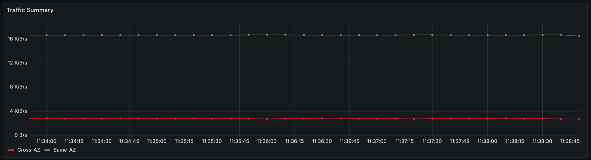

The Traffic Summary panel displays aggregate traffic, both in-zone and out-of-zone.  In the Traffic Summary panel you will observe the "magic moment" where, when enabling HAZL, cross-az traffic drops and same-az traffic climbs and the lines cross, as well as observe how HAZL sends traffic out-of-zone when dealing with latency or a service failure.

**Query:**

```yaml
sum (
  sum(
    rate(
      outbound_tcp_write_bytes_total{
        cluster_name="$cluster_name", tls="true", namespace=~"$namespace", workload_name!="buoyant-cloud-metrics",peer="dst", dst_zone!=""
      }[1m]
    )
    +
    rate(
      outbound_tcp_read_bytes_total{
        cluster_name="$cluster_name", tls="true", namespace=~"$namespace", workload_name!="buoyant-cloud-metrics",peer="dst", dst_zone!=""
      }[1m]
    )
  ) by (namespace, workload_name, pod, instance, dst_namespace, dst_workload_name, dst_pod, dst_zone)
  * on (pod) group_left (topology_kubernetes_io_zone)
  (
    sum(
      container_memory_working_set_bytes{cluster_name="$cluster_name", container="linkerd-proxy"}
    ) by (pod, topology_kubernetes_io_zone)
    * 0 + 1
  )
  unless ignoring(matching_zone)
  (
    label_replace(
      sum(
        rate(
          outbound_tcp_write_bytes_total{
            cluster_name="$cluster_name", tls="true", namespace=~"$namespace", workload_name!="buoyant-cloud-metrics",peer="dst", dst_zone!=""
          }[1m]
        )
        +
        rate(
          outbound_tcp_read_bytes_total{
            cluster_name="$cluster_name", tls="true", namespace=~"$namespace", workload_name!="buoyant-cloud-metrics",peer="dst", dst_zone!=""
          }[1m]
        )
      ) by (namespace, workload_name, pod, instance, dst_namespace, dst_workload_name, dst_pod, dst_zone)
      * on (pod) group_left (topology_kubernetes_io_zone)
      (
        sum(
          container_memory_working_set_bytes{cluster_name="$cluster_name", container="linkerd-proxy"}
        ) by (pod, topology_kubernetes_io_zone)
        * 0 + 1
      ),
      "matching_zone",
      "$1",
      "topology_kubernetes_io_zone",
      "(.*)"
    )
    ==
    label_replace(
      sum(
        rate(
          outbound_tcp_write_bytes_total{
            cluster_name="$cluster_name", tls="true", namespace=~"$namespace", workload_name!="buoyant-cloud-metrics",peer="dst", dst_zone!=""
          }[1m]
        )
        +
        rate(
          outbound_tcp_read_bytes_total{
            cluster_name="$cluster_name", tls="true", namespace=~"$namespace", workload_name!="buoyant-cloud-metrics",peer="dst", dst_zone!=""
          }[1m]
        )
      ) by (namespace, workload_name, pod, instance, dst_namespace, dst_workload_name, dst_pod, dst_zone)
      * on (pod) group_left (topology_kubernetes_io_zone)
      (
        sum(
          container_memory_working_set_bytes{cluster_name="$cluster_name", container="linkerd-proxy"}
        ) by (pod, topology_kubernetes_io_zone)
        * 0 + 1
      ),
      "matching_zone",
      "$1",
      "dst_zone",
      "(.*)"
    )
  )
)
```

The next two traffic panels provide a window in to where traffic flows, both in-zone and out-of-zone.

### Panel: Same-AZ Traffic: By Destination

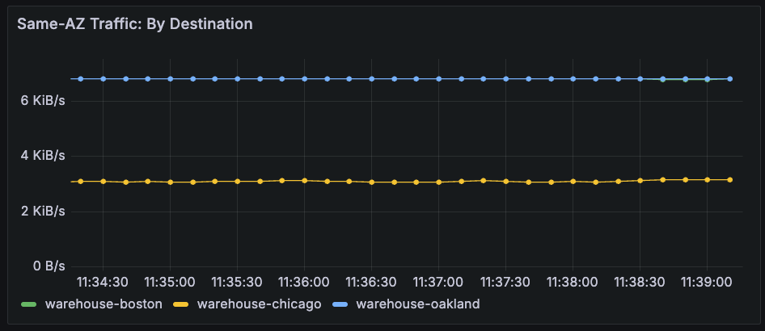

This panel details in-zone traffic, by destination.

Query:

```yaml
sum (
  sum(
    rate(
      outbound_tcp_write_bytes_total{
        cluster_name="$cluster_name", tls="true", namespace=~"$namespace", workload_name!="buoyant-cloud-metrics",peer="dst", dst_zone!=""
      }[1m]
    )
    +
    rate(
      outbound_tcp_read_bytes_total{
        cluster_name="$cluster_name", tls="true", namespace=~"$namespace", workload_name!="buoyant-cloud-metrics",peer="dst", dst_zone!=""
      }[1m]
    )
  ) by (namespace, workload_name, pod, instance, dst_namespace, dst_workload_name, dst_pod, dst_zone)
  * on (pod) group_left (topology_kubernetes_io_zone)
  (
    sum(
      container_memory_working_set_bytes{cluster_name="$cluster_name", container="linkerd-proxy"}
    ) by (pod, topology_kubernetes_io_zone)
    * 0 + 1
  )
  and ignoring(matching_zone)
  (
    label_replace(
      sum(
        rate(
          outbound_tcp_write_bytes_total{
            cluster_name="$cluster_name", tls="true", namespace=~"$namespace", workload_name!="buoyant-cloud-metrics",peer="dst", dst_zone!=""
          }[1m]
        )
        +
        rate(
          outbound_tcp_read_bytes_total{
            cluster_name="$cluster_name", tls="true", namespace=~"$namespace", workload_name!="buoyant-cloud-metrics",peer="dst", dst_zone!=""
          }[1m]
        )
      ) by (namespace, workload_name, pod, instance, dst_namespace, dst_workload_name, dst_pod, dst_zone)
      * on (pod) group_left (topology_kubernetes_io_zone)
      (
        sum(
          container_memory_working_set_bytes{cluster_name="$cluster_name", container="linkerd-proxy"}
        ) by (pod, topology_kubernetes_io_zone)
        * 0 + 1
      ),
      "matching_zone",
      "$1",
      "topology_kubernetes_io_zone",
      "(.*)"
    )
    ==
    label_replace(
      sum(
        rate(
          outbound_tcp_write_bytes_total{
            cluster_name="$cluster_name", tls="true", namespace=~"$namespace", workload_name!="buoyant-cloud-metrics",peer="dst", dst_zone!=""
          }[1m]
        )
        +
        rate(
          outbound_tcp_read_bytes_total{
            cluster_name="$cluster_name", tls="true", namespace=~"$namespace", workload_name!="buoyant-cloud-metrics",peer="dst", dst_zone!=""
          }[1m]
        )
      ) by (namespace, workload_name, pod, instance, dst_namespace, dst_workload_name, dst_pod, dst_zone)
      * on (pod) group_left (topology_kubernetes_io_zone)
      (
        sum(
          container_memory_working_set_bytes{cluster_name="$cluster_name", container="linkerd-proxy"}
        ) by (pod, topology_kubernetes_io_zone)
        * 0 + 1
      ),
      "matching_zone",
      "$1",
      "dst_zone",
      "(.*)"
    )
  )
) by (dst_namespace, dst_workload_name)
```

### Panel: Cross-AZ Traffic: By Destination

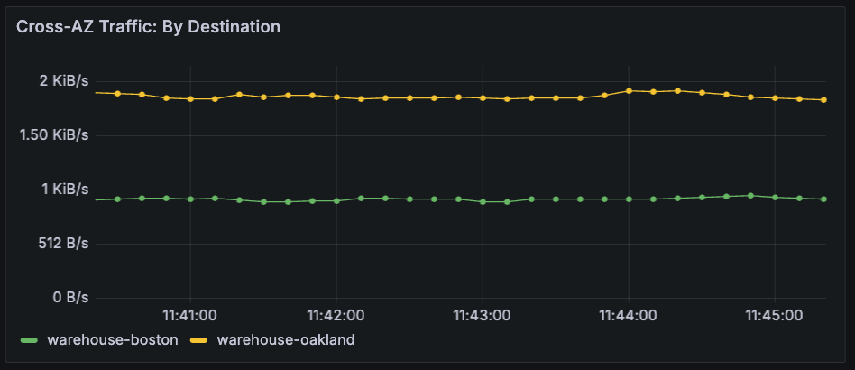

This panel details out-of-zone traffic, by destination.

Query:

```yaml
sum (
  sum(
    rate(
      outbound_tcp_write_bytes_total{
        cluster_name="$cluster_name", tls="true", namespace=~"$namespace", workload_name!="buoyant-cloud-metrics",peer="dst", dst_zone!=""
      }[1m]
    )
    +
    rate(
      outbound_tcp_read_bytes_total{
        cluster_name="$cluster_name", tls="true", namespace=~"$namespace", workload_name!="buoyant-cloud-metrics",peer="dst", dst_zone!=""
      }[1m]
    )
  ) by (namespace, workload_name, pod, instance, dst_namespace, dst_workload_name, dst_pod, dst_zone)
  * on (pod) group_left (topology_kubernetes_io_zone)
  (
    sum(
      container_memory_working_set_bytes{cluster_name="$cluster_name", container="linkerd-proxy"}
    ) by (pod, topology_kubernetes_io_zone)
    * 0 + 1
  )
  unless ignoring(matching_zone)
  (
    label_replace(
      sum(
        rate(
          outbound_tcp_write_bytes_total{
            cluster_name="$cluster_name", tls="true", namespace=~"$namespace", workload_name!="buoyant-cloud-metrics",peer="dst", dst_zone!=""
          }[1m]
        )
        +
        rate(
          outbound_tcp_read_bytes_total{
            cluster_name="$cluster_name", tls="true", namespace=~"$namespace", workload_name!="buoyant-cloud-metrics",peer="dst", dst_zone!=""
          }[1m]
        )
      ) by (namespace, workload_name, pod, instance, dst_namespace, dst_workload_name, dst_pod, dst_zone)
      * on (pod) group_left (topology_kubernetes_io_zone)
      (
        sum(
          container_memory_working_set_bytes{cluster_name="$cluster_name", container="linkerd-proxy"}
        ) by (pod, topology_kubernetes_io_zone)
        * 0 + 1
      ),
      "matching_zone",
      "$1",
      "topology_kubernetes_io_zone",
      "(.*)"
    )
    ==
    label_replace(
      sum(
        rate(
          outbound_tcp_write_bytes_total{
            cluster_name="$cluster_name", tls="true", namespace=~"$namespace", workload_name!="buoyant-cloud-metrics",peer="dst", dst_zone!=""
          }[1m]
        )
        +
        rate(
          outbound_tcp_read_bytes_total{
            cluster_name="$cluster_name", tls="true", namespace=~"$namespace", workload_name!="buoyant-cloud-metrics",peer="dst", dst_zone!=""
          }[1m]
        )
      ) by (namespace, workload_name, pod, instance, dst_namespace, dst_workload_name, dst_pod, dst_zone)
      * on (pod) group_left (topology_kubernetes_io_zone)
      (
        sum(
          container_memory_working_set_bytes{cluster_name="$cluster_name", container="linkerd-proxy"}
        ) by (pod, topology_kubernetes_io_zone)
        * 0 + 1
      ),
      "matching_zone",
      "$1",
      "dst_zone",
      "(.*)"
    )
  )
) by (dst_namespace, dst_workload_name)
```

## Latency Panels

Latency has an impact on traffic routing with HAZL, and we observe latency (p95) collectively and by requestor.

### Panel: Overall Latency: All Orders (ms)

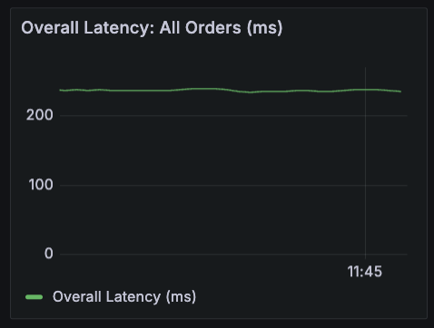

_**NEED ASSISTANCE: This panel needs to be changed from a sum total of latency to more of an average across all requestors.**_

Query:

```yaml
sum(
    histogram_quantile(
        0.95,
        sum(
            rate(
                outbound_response_latency_ms_bucket{cluster_name=~"$cluster_name", namespace=~"$namespace", workload_kind=~"$workload_kind", workload_name=~"orders-.*"}[1m]
            )
        ) by (
            le,cluster_id,cluster_name,
            namespace,workload_kind,workload_name
        )
    )
)
```

### Panel: Latency: Orders By Zone (ms)

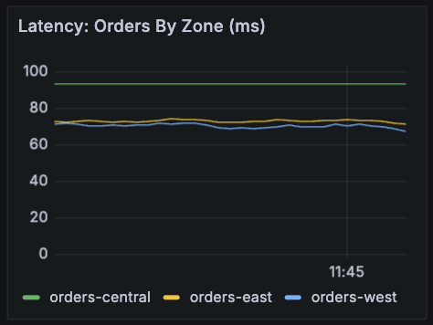

This panel displays latency (p95) for all requestors, by requestor.

Query:

```yaml
sum(
    histogram_quantile(
        0.95,
        sum(
            rate(
                outbound_response_latency_ms_bucket{cluster_name=~"$cluster_name", namespace=~"$namespace", workload_kind=~"$workload_kind", workload_name=~"orders-.*"}[1m]
            )
        ) by (
            le,cluster_id,cluster_name,
            namespace,workload_kind,workload_name
        )
    )
) by (workload_name)
```

## Success Rate Panels

No matter how we get the application traffic to its destination, it's critical that we keep the applications online and available.  Success Rate metrics allow us to track that.  We can use these metrics to assure that we're meeting this key need.

### Panel: Overall Success Rate: All Orders

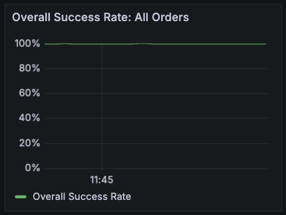

_**NEED ASSISTANCE: We're looking to measure overall success rate for all of the `orders` deployments here, including retries.**_

Query:

```yaml
sum(rate(outbound_route_response_total{classification="success", cluster_name="$cluster_name", namespace=~"$namespace", workload_kind=~"$workload_kind", workload_name=~"orders-.*"}[1m]))
/
sum(rate(outbound_route_response_total{cluster_name="$cluster_name", namespace=~"$namespace", workload_kind=~"$workload_kind", workload_name=~"orders-.*"}[1m]))
```

### Panel: Success Rate: Orders By Zone

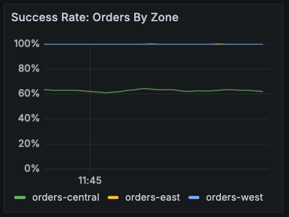

_**NEED ASSISTANCE: We're looking to measure individual success rates for each of the `orders` deployments here, including retries.**_

Query:

```yaml
sum(rate(outbound_route_response_total{classification="success", cluster_name="$cluster_name", namespace=~"$namespace", workload_kind=~"$workload_kind", workload_name=~"orders-.*"}[1m])) by (workload_name)
/
sum(rate(outbound_route_response_total{cluster_name="$cluster_name", namespace=~"$namespace", workload_kind=~"$workload_kind", workload_name=~"orders-.*"}[1m])) by (workload_name)
```

## Requests Panels

This row of panels details requests, overall and by requestor/endpoint:

- Overall requests by all orders replicas
- Requests by each order instance
- Overall requests serviced by all warehouse replicas
- Requests serviced by each warehouse instance

This data provides insight into workload distribution.

### Panel: Overall Requests: All Orders

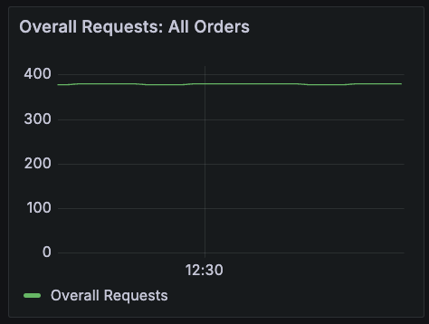

This panel shows overall requests by all orders replicas.

Query:

```yaml
sum(workload:outbound_response:rate1m{cluster_name=~"$cluster_name", namespace=~"$namespace", workload_kind=~"$workload_kind", workload_name=~"orders-.*"})
```

### Panel: Requests: Orders By Zone

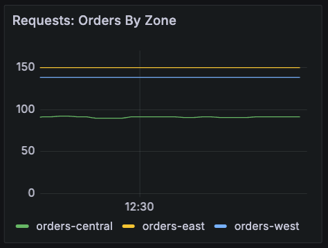

This panel presents requests by each order instance.

Query:

```yaml
sum(workload:outbound_response:rate1m{cluster_name=~"$cluster_name", namespace=~"$namespace", workload_kind=~"$workload_kind", workload_name=~"orders-.*"}) by (workload_name)
```

### Panel: Overall Requests: All Warehouses

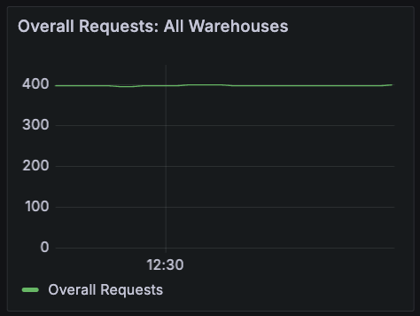

This panel displays overall requests serviced by all warehouse replicas.

Query:

```yaml
sum(workload:inbound_response:rate1m{cluster_name=~"$cluster_name", namespace=~"$namespace", workload_kind=~"$workload_kind", workload_name=~"warehouse-.*"})
```

### Panel: Requests By Warehouse

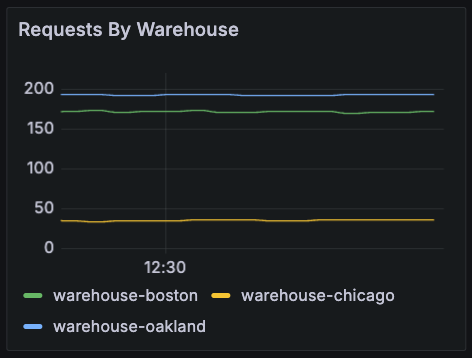

This panel breaks out requests serviced by each warehouse instance.

Query:

```yaml
sum(workload:inbound_response:rate1m{cluster_name=~"$cluster_name", namespace=~"$namespace", workload_kind=~"$workload_kind", workload_name=~"warehouse-.*"}) by (workload_name)
```

## The Rest of the Dashboard

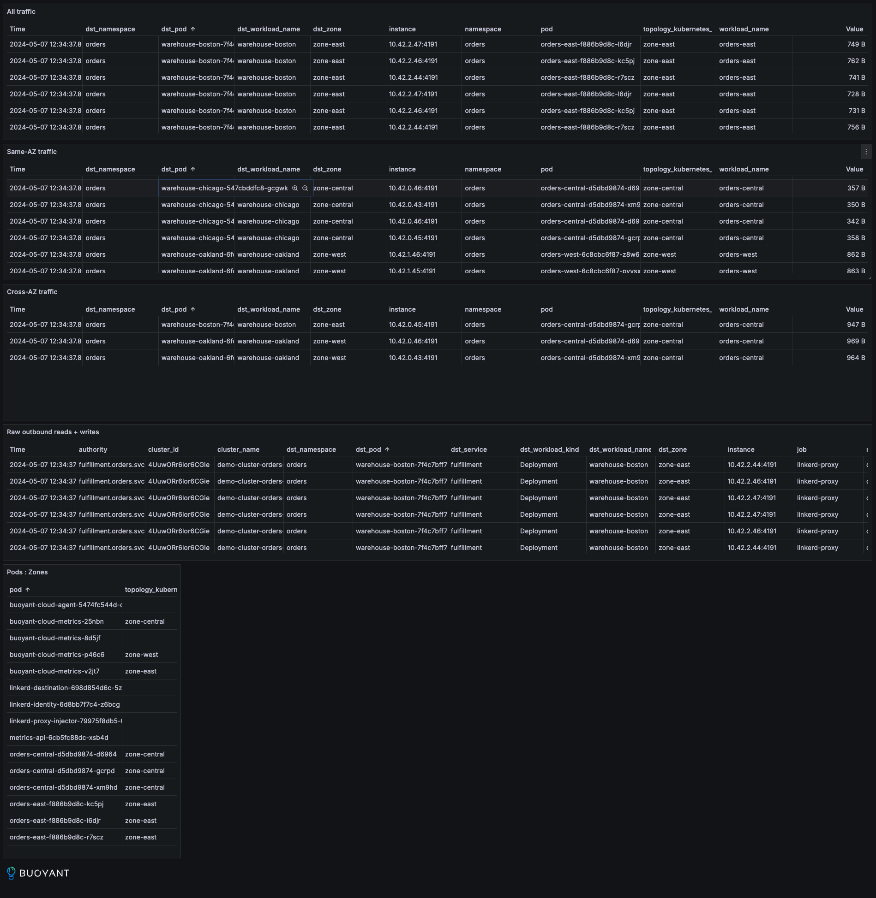

The rest of the panels provide some raw statistics on traffic and pods.

## Summary

Using this dashboard for testing or demonstrations provides a more visual interpretation of the behavior of HAZL and Topology Aware Routing, and how each responds to a number of conditions:

- Latency
- Endpoint Outages
- Increases/Decreases in Load
- Horizontal Pod Autoscaling

Again, **_PLEASE CLONE THE DASHBOARD TEMPLATE TO YOUR FOLDER! DO NOT EDIT THE DASHBOARD TEMPLATE!_**  Feel free to do whatever you'd like with **_your copy_**.

Good hunting!

Click [here](./README.md) to go back to the main document.
